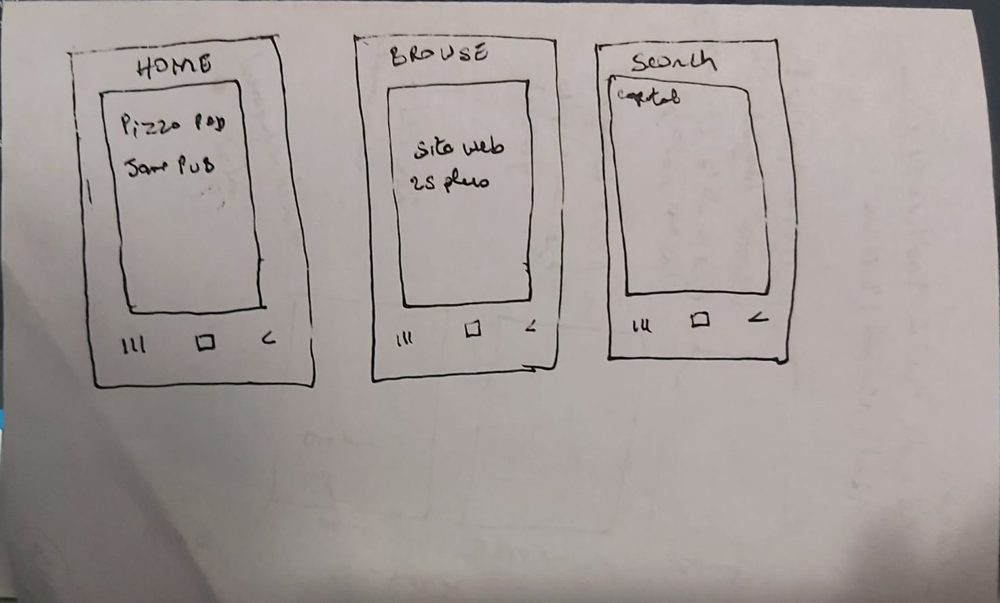
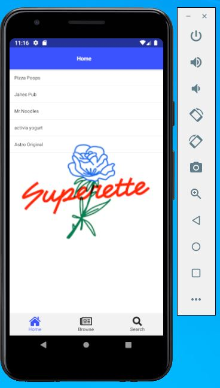
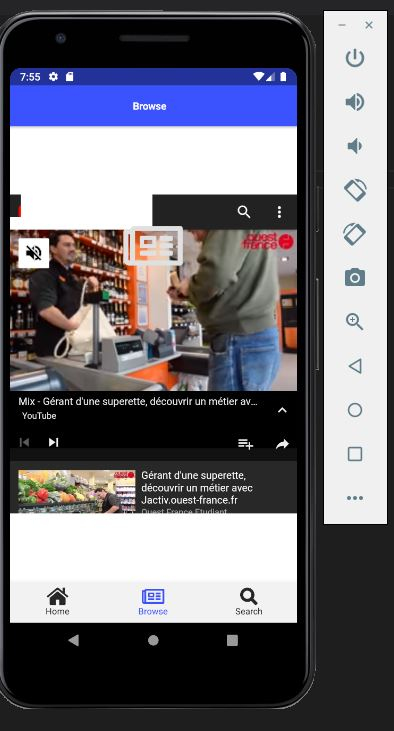
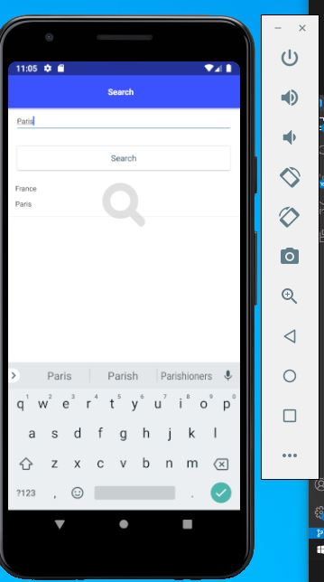
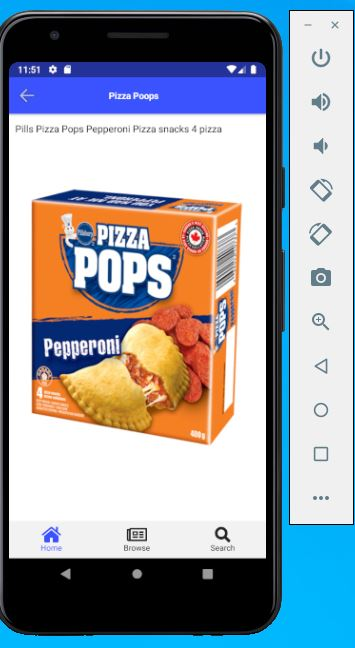
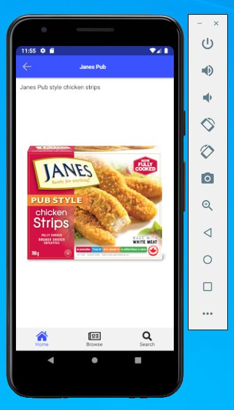
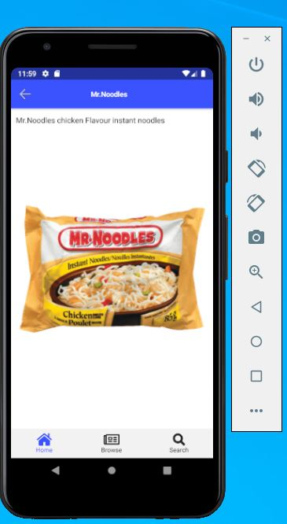
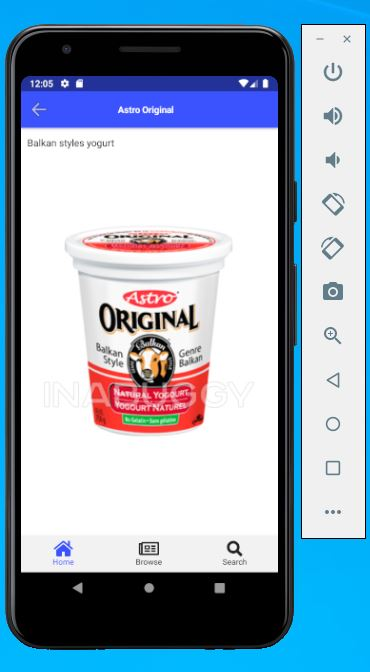
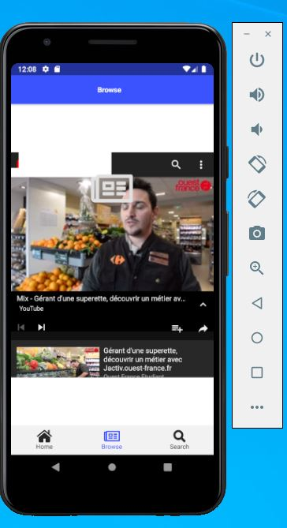

# :boom: Application mobile superette 2splus :boom:

## Sketch de la superette 2splus :

Notre application aura trois page principale a savoir le home qui comportera la liste des produits de l'entreprise, 
le browser qui comportera soit le site web de l'entreprise, soit une video de l'entreprise et le search qui permettra de faire des recherches.

</img>

## :hankey: Illustration: :hankey:

</img>   </img>   </img>

##  :white_check_mark: Home

Dans la page home lorsque vous cliquez sur un item sa vous ouvre une autre page qui est la description du produit et la photo du produit.

</img>      </img>

</img>      </img>

## :white_check_mark: Browser

Dans cette partir nous vous trouverez une video de l'entreprise.

</img>

## :white_check_mark: Search
Dans le search vous pouvez taper la capital de ni'importe quel pays et l'application vous donnera le nom du pays

</img>

:smile:Voila en gros en quoi consiste notre petite application que nous avons implemente. J'espere que vous allez apprecier. Enjoy it :apple::smile:
