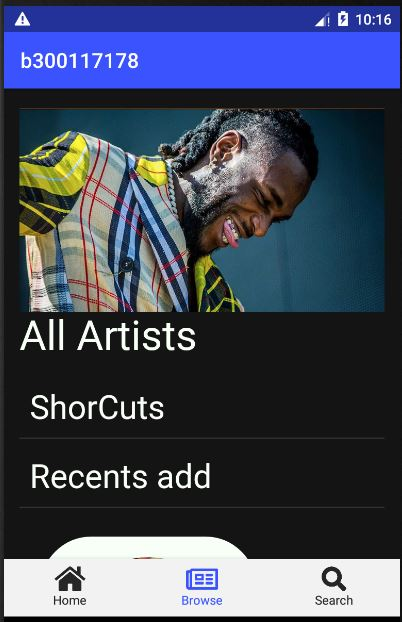

# :rocket: AfricaMusic App

-----------------------------

## Maket

## :bell: lorsque on **clique** sur un artist il nous affiche tous ces **song**
--------------------------

## Composant Utiliser
1. **TabView** qui nous donne nos trois menus **"Artists" "Albums" "Popular"**
2. **Image** pour afficher les image
3. **css** pour afficher du style a notre app

## Rendu
## 1. Home Component

## 2. Browse Component

## :bell: the web page [africamusic web page](https://africamusic.herokuapp.com/)

