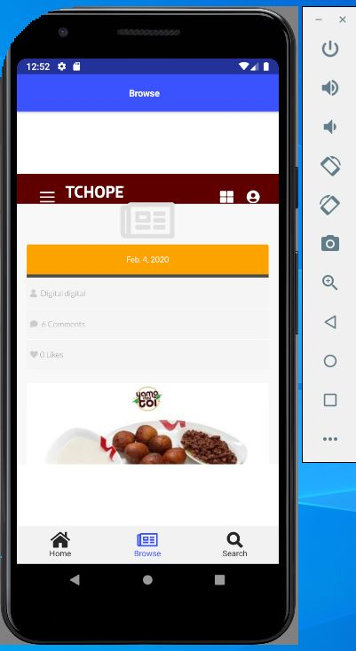
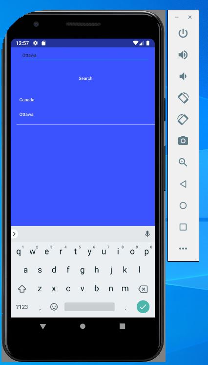

# :evergreen_tree: Application Mobile Retaurant Mamamiya 

 
 ## :mushroom: Description de mon projet
 
 Cet application mobile a été créé pour pour afficher le menu du restaurant qui s'effectuera dans la page Home,  le browser qui contient le site web du restaurant et enfin une page search qui permettra à nos clients d'effectuer des recherche
 
 
 ## :ant: Home
 
 </img>  </img>
 
 </img>   </img>
 
 
 ## :rose: Browser
 
 :white_check_mark:c'est dans cette page que se trouve le site web du Restaurant Mamamiya
 
</img>  

## :eyes: Search

:white_check_mark: Cette parge permet d'effectuer des recherche

</img>  

:trophy: Tout est fin prêt pour l'utilisation de notre application  
