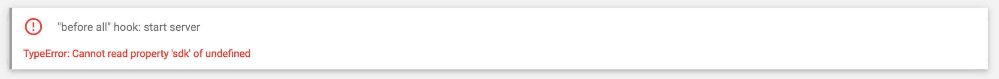

# :iphone: Android

#### :a: Setting up appium with NativeScript

:bulb: Set `ANDROID_AVD_HOME` due to a [bug](https://github.com/NativeScript/mobile-devices-controller/issues/10)



```
$ export ANDROID_AVD_HOME="???"
```

:round_pushpin: Emulator: set `avd` property in `appium.capabilities` to `Device Name`

```
$ ns devices
Connected devices & emulators
Searching for devices...
┌───┬──────────────┬──────────┬───────────────────┬──────────┬───────────┬─────────────────┐
│ # │ Device Name  │ Platform │ Device Identifier │ Type     │ Status    │ Connection Type │
│ 1 │ test         │ Android  │ emulator-5554     │ Emulator │ Connected │ Local           │
└───┴──────────────┴──────────┴───────────────────┴──────────┴───────────┴─────────────────┘
```

- [ ] Edit `appium.capabilities.json` file

```json
    "android28": {
        "platformName": "Android",
        "platformVersion": "28",
        "avd": "test",
        "lt": 60000,
        "newCommandTimeout": 720,
        "noReset": true,
        "fullReset": false,
        "app": ""
    },
```

- [ ] Run the test

```
$ npm run e2e -- --runType android28
```

:round_pushpin: Real Device: Set `deviceToken` property in `appium.capabilities` to `Device Identifier`

```
$ ns devices
Connected devices & emulators
Searching for devices...
┌───┬──────────────┬──────────┬───────────────────┬────────┬───────────┬─────────────────┐
│ # │ Device Name  │ Platform │ Device Identifier │ Type   │ Status    │ Connection Type │
│ 1 │ nyc4xlwifiyy │ Android  │ R52N94D54BK       │ Device │ Connected │ USB             │
└───┴──────────────┴──────────┴───────────────────┴────────┴───────────┴─────────────────┘
```

- [ ] Edit `appium.capabilities.json` file

```json
   "android29": {
        "platformName": "Android",
        "platformVersion": "29",
        "deviceToken": "R52N94D54BK",
        "lt": 60000,
        "newCommandTimeout": 720,
        "noReset": true,
        "fullReset": false,
        "app": ""
    },
```

- [ ] Run the test

```
$ npm run e2e -- --runType android29
```

## :b: Separate Testing of Appium Desktop

[Testing Android Applications With Appium | Appium Tutorial For Mobile Testing | Edureka](https://www.youtube.com/watch?v=i1tQ1pjEFWw)

Simple Example of Capabilities:

- [ ] Locate your device name

```
$ adb devices
List of devices attached
emulator-5554	device
```

- [ ] Locate your App `Package` and `Activity` name

* run your app on the emulator

* Start tracing the log

```
$ adb logcat > keeplog.txt
```

* Find the App `Package` and `Activity` name

for example `org.nativescript.b300098957/com.tns.NativeScriptActivity` for NS app name called `b300098957`

- [ ] Resulting capability file

```json
{
  "deviceName": "emulator-5554",
  "platformName": "Android",
  "appPackage": "org.nativescript.b300098957",
  "appActivity": "com.tns.NativeScriptActivity",
  "noReset": true
}
```


