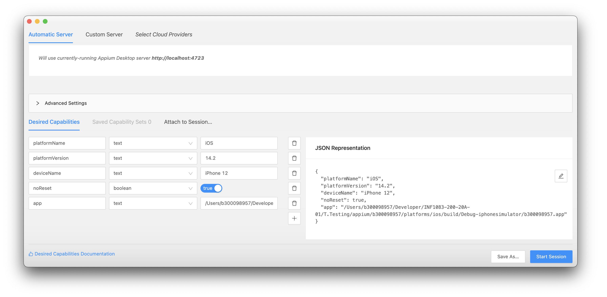
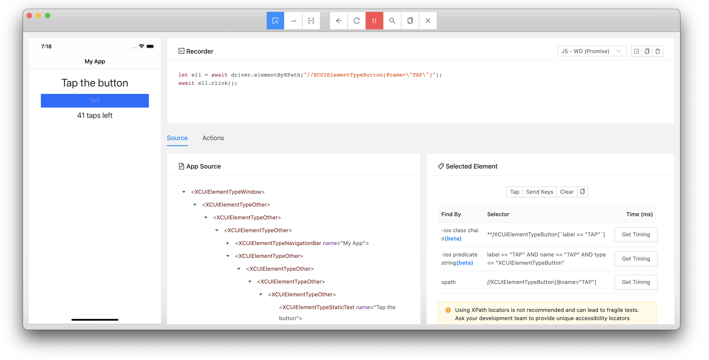

# :iphone: iOS

#### :a: Setting up appium with NativeScript

- [ ] Install `appium` CLI server

You need to install `appium` CLI server first, see [Know Errors](README.md#x-known-errors) below

```
$ npm install appium --global
```


:round_pushpin: Emulator: set `bundleId` property in `appium.capabilities` to `org.nativescript.b300098957` and others

```
$ ns devices
Error while loading nativescript-cloud is: Default commands should be required before child commands

Connected devices & emulators
Searching for devices...
┌───┬─────────────┬──────────┬──────────────────────────────────────┬──────────┬───────────┬─────────────────┐
│ # │ Device Name │ Platform │ Device Identifier                    │ Type     │ Status    │ Connection Type │
│ 1 │ iPhone 12   │ iOS      │ 9BDC9951-6D3F-4F1E-9D9E-FF598AFEB09F │ Emulator │ Connected │ Local           │
└───┴─────────────┴──────────┴──────────────────────────────────────┴──────────┴───────────┴─────────────────┘
```

- [ ] Edit `appium.capabilities.json` file

```json
    "sim.iPhone12": {
        "platformName": "iOS",
        "platformVersion": "/14*/",
        "deviceName": "iPhone 12",
        "bundleId": "org.nativescript.b300098957",
        "noReset": false,
        "fullReset": false,
        "app": ""
    }
```

- [ ] Run the test

```
$ npm run e2e -- --runType android28
```

:round_pushpin: Real Device: Set `deviceToken` property in `appium.capabilities` to `Device Identifier`

```
$ ns device% ns devices
Error while loading nativescript-cloud is: Default commands should be required before child commands

Connected devices & emulators
Searching for devices...
┌───┬─────────────┬──────────┬──────────────────────────────────────────┬────────┬───────────┬─────────────────┐
│ # │ Device Name │ Platform │ Device Identifier                        │ Type   │ Status    │ Connection Type │
│ 1 │ myIpad      │ iOS      │ c08f504402034771f5044020344404203489a87c │ Device │ Connected │ Wifi            │
└───┴─────────────┴──────────┴──────────────────────────────────────────┴────────┴───────────┴─────────────────┘
```

- [ ] Edit `appium.capabilities.json` file

```json
    "dev.iPhone12": {
        "platformName": "ios",
        "platformVersion": "14.2",
        "deviceName": "myIpad",
        "deviceToken": "c08f504402034771f5044020344404203489a87c",
        "noReset": false,
        "fullReset": false,
        "app": ""
    },
```

- [ ] Run the test

```
$ npm run e2e -- --runType dev.iPhone12
```

## :b: Separate Testing of Appium Desktop

There is also a dependency, made necessary by [Facebook's WebDriverAgent](https://github.com/facebook/WebDriverAgent), for the Carthage dependency manager. If you do not have Carthage on your system, it can also be installed with Homebrew

```
$ brew install carthage
```

For [real devices](http://appium.io/docs/en/drivers/ios-xcuitest-real-devices) we can use xcpretty to make Xcode output more reasonable. This can be installed by

```
$ sudo gem install xcpretty
```

Simple Example of Capabilities:

- [ ] Locate your device name


```
$ xcrun simctl list devices | grep '(Booted)'
    iPhone 12 (9BDC9951-6D3F-4F1E-9D9E-FF598AFEB09F) (Booted) 
```

or

```
% ns devices
Error while loading nativescript-cloud is: Default commands should be required before child commands

Connected devices & emulators
Searching for devices...
┌───┬─────────────┬──────────┬──────────────────────────────────────┬──────────┬───────────┬─────────────────┐
│ # │ Device Name │ Platform │ Device Identifier                    │ Type     │ Status    │ Connection Type │
│ 1 │ iPhone 12   │ iOS      │ 9BDC9951-6D3F-4F1E-9D9E-FF598AFEB09F │ Emulator │ Connected │ Local           │
└───┴─────────────┴──────────┴──────────────────────────────────────┴──────────┴───────────┴─────────────────┘
```

- [ ] Locate your `App` binary

* run your app on the simulator

locate the `app` file: for example, if your project name is `b300098957`, it should be under your project **location** name plus `./platforms/ios/build/Debug-iphonesimulator/b300098957.app`

```
$ ls -l /Users/b300098957/Developer/INF1083-200-20A-01/T.Testing/appium/b300098957/platforms/ios/build/Debug-iphonesimulator/b300098957.app
```


- [ ] Resulting capability file

```json
{
  "platformName": "iOS",
  "platformVersion": "14.2",
  "deviceName": "iPhone 12",
  "uuid": "9BDC9951-6D3F-4F1E-9D9E-FF598AFEB09F",
  "app": "/Users/b300098957/Developer/INF1083-200-20A-01/T.Testing/appium/b300098957/platforms/ios/build/Debug-iphonesimulator/b300098957.app"
}
```

* Update the `JSON Representation` Text Box and Click the **Start Session** Button

</img>

* When the session is on, you can now start recording and play with the Appium Desktop to get the testing source code (i.e. Javascript WD Promise)

</img>

# References

</img>

https://stackoverflow.com/questions/46673050/unable-to-boot-device-due-to-insufficient-system-resources-using-xcode-9

http://appium.io/docs/en/drivers/ios-xcuitest-real-devices/ 

https://www.techaheadcorp.com/blog/how-to-install-appium-on-mac/

https://www.rubydoc.info/github/appium/ruby_lib_core/Appium/Core/Base/Driver:session_capabilities

# :x: Known Errors

| :x: `TypeError` | :bulb: Fix |  
|------------|------------|
| [[ERR_INVALID_ARG_TYPE]: The "pid" argument must be of type number. Received type undefined](https://github.com/NativeScript/nativescript-dev-appium/issues/220) | `$ npm install appium --global` |
| [Cannot read property 'statBarHeight' of undefined]() | |
