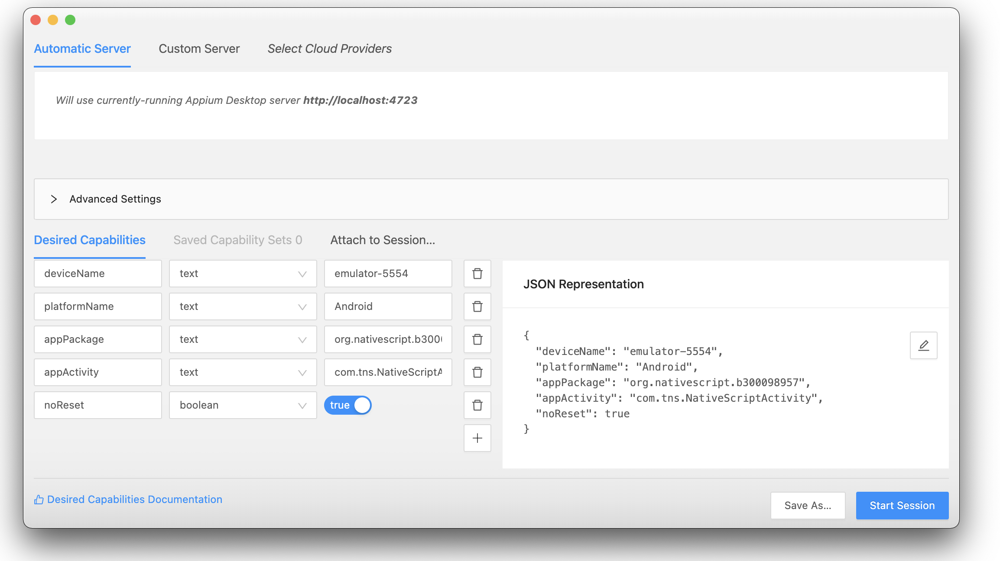

# ui-tests with Appium

## :o: Install Appium-Desktop

:apple: On MacOS

```
$ brew install appium --cask 
```

:computer: On Windows

```
PS > choco install appium-desktop
```

## :a: Create a Project

#### :zero: Install Appium CLI globally

```
$ npm install appium --global 
```

#### :one: create a project, replace b`<`your :id:`>`

https://docs.nativescript.org/plugins/ui-tests

:pushpin: for example the project name will be `b300098957` 

|  tns v7.0.1                                                                  |  Patrons                          |
|------------------------------------------------------------------------------|-----------------------------------|
| `$ ns create b`:id:` --ts                                                    |  taps left                        |

-  [ ]  go to your project 

```
$ cd b300098957
```

-  [ ]  run you project against an emulator or a device

```
$ ns run android
```

-  [ ]  build you project for future tests use

```
$ ns build android
```


#### :two: Add the [Appium](http://appium.io) Library using [nativescript-dev-appium](https://github.com/NativeScript/nativescript-dev-appium)

:pushpin: Choose `typescript` and `mocha`

```
$ npm install nativescript-dev-appium --save-dev 
...
? What kind of project do you use? (Use arrow keys)
  javascript 
❯ typescript 
  angular 
  vue 
  shared-ng-project 
...
? What kind of project do you use? typescript
? Which testing framework do you prefer? (Use arrow keys)
❯ mocha 
  jasmine 
  none 
```

:pushpin: The tree code should look like this

```
b000000000
├── app
├── e2e
    ├── config
        ├── mocha.opts
        ├── appium.capabilities.json
    ├── sample.e2e-test.ts
    ├── setup.ts
    ├── tsconfig.json
├── ...
├── package.json
├── tsconfig.json
```

#### :three: Setting up appium

:bulb: Set `ANDROID_AVD_HOME` due to a [bug](https://github.com/NativeScript/mobile-devices-controller/issues/10)


```
$ export ANDROID_AVD_HOME="???"
```

:round_pushpin: Emulator set `avd` property in `appium.capabilities` to `Device Name`

```
$ ns devices

Connected devices & emulators
Searching for devices...
┌───┬──────────────┬──────────┬───────────────────┬──────────┬───────────┬─────────────────┐
│ # │ Device Name  │ Platform │ Device Identifier │ Type     │ Status    │ Connection Type │
│ 1 │ test         │ Android  │ emulator-5554     │ Emulator │ Connected │ Local           │
└───┴──────────────┴──────────┴───────────────────┴──────────┴───────────┴─────────────────┘
```

- [ ] appium.capabilities.json

```json
    "android28": {
        "platformName": "Android",
        "platformVersion": "28",
        "avd": "test",
        "lt": 60000,
        "newCommandTimeout": 720,
        "noReset": true,
        "fullReset": false,
        "app": ""
    },
```

- [ ] Run the test

```
$ npm run e2e -- --runType android28
```

:round_pushpin: Real Device set `deviceToken` property in `appium.capabilities` to `Device Identifier`

```
$ ns devices

Connected devices & emulators
Searching for devices...
┌───┬──────────────┬──────────┬───────────────────┬────────┬───────────┬─────────────────┐
│ # │ Device Name  │ Platform │ Device Identifier │ Type   │ Status    │ Connection Type │
│ 1 │ nyc4xlwifiyy │ Android  │ R52N94D54BK       │ Device │ Connected │ USB             │
└───┴──────────────┴──────────┴───────────────────┴────────┴───────────┴─────────────────┘
```

- [ ] appium.capabilities.json

```json
   "android29": {
        "platformName": "Android",
        "platformVersion": "29",
        "deviceToken": "R52N94D54BK",
        "lt": 60000,
        "newCommandTimeout": 720,
        "noReset": true,
        "fullReset": false,
        "app": ""
    },
```

- [ ] Run the test

```
$ npm run e2e -- --runType android29
```


## :b: Separate Testing of Appium 

[Testing Android Applications With Appium | Appium Tutorial For Mobile Testing | Edureka](https://www.youtube.com/watch?v=i1tQ1pjEFWw)

Simple Example of Capabilities:

- [ ] Locate your device name

```
$ adb devices
List of devices attached
emulator-5554	device

```

- [ ] Locate your App `Package` and `Activity` name

* run your app on the emulator

* Start tracing the log

```
$ adb logcat > keeplog.txt
```

* Find the App `Package` and `Activity` name

for example `org.nativescript.b300098957/com.tns.NativeScriptActivity` for NS app name called `b300098957`

- [ ] Resulting capability file

```json
{
  "deviceName": "emulator-5554",
  "platformName": "Android",
  "appPackage": "org.nativescript.b300098957",
  "appActivity": "com.tns.NativeScriptActivity",
  "noReset": true
}
```



# References

https://github.com/igniteram/appium-webdriverio-typescript :+1:

https://nativescript.org/blog/start-testing-your-nativescript-apps-properly/

http://appium.io/docs/en/drivers/ios-xcuitest-real-devices/ 

https://www.techaheadcorp.com/blog/how-to-install-appium-on-mac/

# :x: Errors

https://github.com/NativeScript/mobile-devices-controller/issues/10
