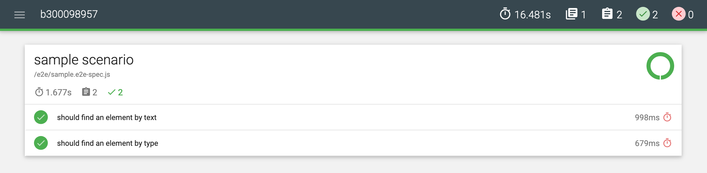

# ui-tests with Appium

## :o: Install Appium-Desktop

:apple: On MacOS

```
$ brew install --cask appium 
```

:bulb: Vérification

```
$ brew list  --cask appium   
==> App
/Applications/Appium.app (92,295 files, 481MB)
```

:computer: On Windows

```
PS > choco install appium-desktop
```

:bulb: Vérification

```
PS > choco info appium-desktop
```

## :a: Create a Project

#### :zero: Install Appium CLI globally

```
$ npm install appium --global 
```

#### :one: create a project, replace b`<`your :id:`>`

https://docs.nativescript.org/plugins/ui-tests

:pushpin: for example the project name will be `b300098957` 

|  tns v7.0.1                                                                  |  Patrons                          |
|------------------------------------------------------------------------------|-----------------------------------|
| `$ ns create b`:id:` --ts                                                    |  taps left                        |

-  [ ]  go to your project 

```
$ cd b300098957
```

-  [ ]  run you project against an emulator or a device

```
$ ns run [android/ios]
```

-  [ ]  build you project for future tests use

```
$ ns build [android/ios]
```


#### :two: Add the [Appium](http://appium.io) Library using [nativescript-dev-appium](https://github.com/NativeScript/nativescript-dev-appium)

:pushpin: Choose `typescript` and `mocha`

```
$ npm install nativescript-dev-appium --save-dev 
...
? What kind of project do you use? (Use arrow keys)
  javascript 
❯ typescript 
  angular 
  vue 
  shared-ng-project 
...
? What kind of project do you use? typescript
? Which testing framework do you prefer? (Use arrow keys)
❯ mocha 
  jasmine 
  none 
```

:pushpin: The tree code should look like this

```
b000000000
├── app
├── e2e
    ├── config
        ├── mocha.opts
        ├── appium.capabilities.json
    ├── sample.e2e-test.ts
    ├── setup.ts
    ├── tsconfig.json
├── ...
├── package.json
├── tsconfig.json
```

### :three: Run the test

- [ ] with [Android](.platforms/android)

- [ ] with [ios](.platforms/ios)

:tada: Final Result in your browser




# References

https://github.com/igniteram/appium-webdriverio-typescript :+1:

https://nativescript.org/blog/start-testing-your-nativescript-apps-properly/

https://medium.com/@sandeepqaops/setting-up-github-actions-for-react-native-mobile-app-for-android-emulator-with-appium-96efa67a359

# :x: Errors

https://github.com/NativeScript/mobile-devices-controller/issues/10
