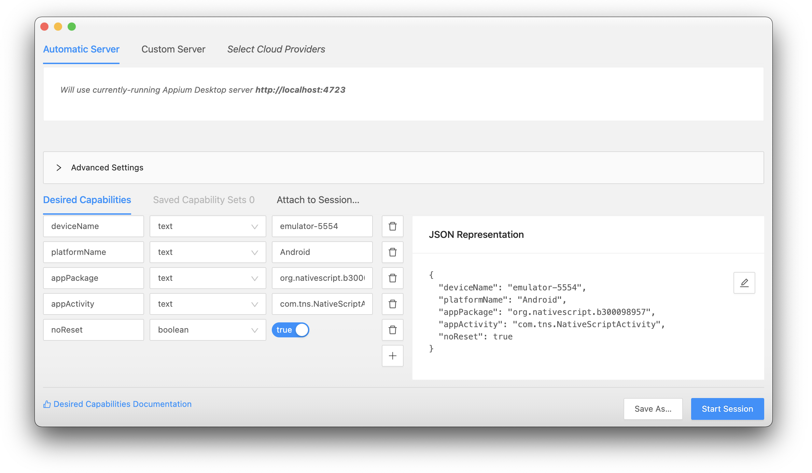

# ui-tests with Appium

## :o: Install Appium-Desktop

:apple: On MacOS

```
$ brew install appium --cask 
```

:computer: On Windows

```
PS > choco install appium-desktop
```

## :a: Create a {NS} Project

#### :zero: Install Appium CLI globally

```
$ npm install appium --global 
```


#### :one: create a project, replace b`<`your :id:`>`

https://docs.nativescript.org/plugins/ui-tests

:pushpin: for example the project name will be `b300098957` 

|  tns v7.0.1                                                                  |  Patrons                          |
|------------------------------------------------------------------------------|-----------------------------------|
| `$ ns create b`:id:` --ng                                                    |  Hellow World                     |

* go to your project 

#### :two: Add the [Appium](http://appium.io) Library using [nativescript-dev-appium](https://github.com/NativeScript/nativescript-dev-appium)

:pushpin: Choose `typescript` and `mocha`

```
$ echo angular | npm install nativescript-dev-appium --save-dev 
...
? What kind of project do you use? (Use arrow keys)
  javascript 
❯ typescript 
  angular 
  vue 
  shared-ng-project 
...
? What kind of project do you use? typescript
? Which testing framework do you prefer? (Use arrow keys)
❯ mocha 
  jasmine 
  none 
```

````
    "android28": {
        "platformName": "Android",
        "platformVersion": "28",
        "deviceName": "emulator-5554",
        "avd": "test",
        "lt": 60000,
        "newCommandTimeout": 720,
        "noReset": true,
        "fullReset": false,
        "app": ""
    },
```

```
$ export ANDROID_AVD_HOME="???"
```

#### :three: Tree Code

```
b000000000
├── app
├── e2e
    ├── config
        ├── jasmine.opts
        ├── appium.capabilities.json
    ├── sample.e2e-test.ts
    ├── setup.ts
    ├── tsconfig.json
├── ...
├── package.json
├── tsconfig.json
```


```
$ ns build android
```

## :b: Separate Testing of Appium 

[Testing Android Applications With Appium | Appium Tutorial For Mobile Testing | Edureka](https://www.youtube.com/watch?v=i1tQ1pjEFWw)

Simple Example of Capabilities:

- [ ] Locate your device name

```
$ adb devices
List of devices attached
emulator-5554	device

```

- [ ] Locate your App `Package` and `Activity` name

* run your app on the emulator

* Start tracing the log

```
$ adb logcat > keeplog.txt
```

* Find the App `Package` and `Activity` name

for example `org.nativescript.b300098957/com.tns.NativeScriptActivity` for NS app name called `b300098957`

- [ ] Resulting capability file

```json
{
  "deviceName": "emulator-5554",
  "platformName": "Android",
  "appPackage": "org.nativescript.b300098957",
  "appActivity": "com.tns.NativeScriptActivity",
  "noReset": true
}
```



# References

https://github.com/igniteram/appium-webdriverio-typescript :+1:

https://nativescript.org/blog/start-testing-your-nativescript-apps-properly/

http://appium.io/docs/en/drivers/ios-xcuitest-real-devices/ 

https://www.techaheadcorp.com/blog/how-to-install-appium-on-mac/

# :x: Errors

https://github.com/NativeScript/mobile-devices-controller/issues/10
